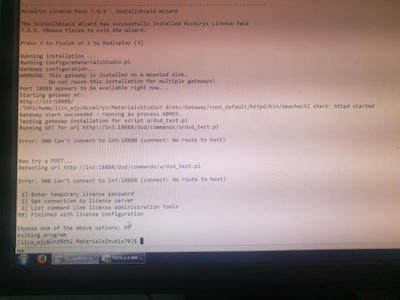

## This is Luckpeople Pages

       Phone:     +86 13755016504
       Mail:          juanchen at nudt.edu.cn
       Address : School of Computer Science, National University of Defense Technology
                        Changsha, Hunan Province, 410073, China
                        

### Introduction
I am currently an associate professor in the School of Computer Science at the National University of Defense Technology, China. Now I am in University of California, Riverside for one-year visiting scholar till December 2017!
   
My main research interests are energy efficiency computing, including how to save energy consumption for GPU systems or CPU/GPU heterogenous systems, how to utilize DVFS, undervolting or overclocking techniques to save more energy consumption on CPU, GPU or CPU/GPU heterogenous systems, how to reduce power consumption of HPC interconnection networks utilizing router shutting off, how to analyze the communication characteristics for all kinds of large-scale scientific computing applications, and so on.

I also have great interests in CS education. Now I am focusing on how to integrate  Parallel Computational Thinking Ideas to our Introduction to Parallel Programming Courses ! Please see Here  for more details about PCT! 

Welcome to contact me if you have some ideas about the above researches!

### Education
   December 2016 to December 2017, visiting scholar in California University of Riverside, US.
 
   September 2001 to June 2007, Ph.D. student in National University of Defense Technology, Changsha, Hunan Province.
 
   September 1997 to July 2001, undergraduate student in Southeast University, Nanjing, Jiangsu Province.
 
### Teaching Courses

  Introduction to Parallel Programming for graduate student
 
  Introduction to Parallel Programming for undergraduate student
 
  College Computer Fundamentals for undergraduate student
 
  Computer Programming (C++) for undergraduate student

### Memberships

 ACM Member;
 
 Vice Secretary of SIGCSE China Chapter;
 
 SIGCSE Member;
 
 Senior Member of CCF (China Computer Federation);
 
 Member of the Theoretical Computer Science Technical Committee of the China Computer Federation;
 
### Program Committee or Reviewer

  ITiCSE 2017
 
  ACM SIGCSE posters 2017
 
  ACM SIGCSE China in ACAC
 
  National Natural Science Foundation of China (NSFC)
 
  IEEE International Conference on High Performance Computing and Communications
 
  International Conference on Computational Science (ICCS)
 
  International Conference on Embedded Software and Systems (ICESS)
 
  Frontiers of Computer Science in China
 
  IEEE Systems Journal
 
  Computer Engineering and Science
 
  National Conference of Theoretical Computer Science (NCTCS)
  
  
### Selected Publications in Recent Years

**Juan Chen***, Li Shen and Jianping Yin. Parallel Computational Thinking: Our Practice on Tianhe-2. Invited Report. SIGCSE 2016 Pre-Symposium: Computational Thinking - A Chinese Perspective. http://msra.cn/zh-cn/connections/sigcse-2016-pre-symposium.aspx

**Juan Chen**, Yuhua Tang, Yong Dong, Jingling Xue, Zhiyuan Wang and Wenhao Zhou. Reducing Static Energy in Supercomputer Interconnection Networks Using Topology-Aware Partitioning.  IEEE Transactions on Computers 65(8): 2588-2602 (2016). SCI [pdf]. 

Wenhao Zhou, **Juan Chen***, Chen Cui, Qian Wang, Dezun Dong, Yuhua Tang. Detailed and Clock-Driven Simulation for HPC Interconnection Network. Frontiers of Computer Science 10(5): 797-811 (2016). SCI [pdf]

Zhiyuan Wang, Yuhua Tang*, **Juan Chen**, Jingling Xue, Yun Zhou, Yong Dong. Energy Wall for Exascale Supercomputing. Computing&Informatics 35(4): 941-962(2016). SCI [pdf]

Wenhao Zhou, **Juan Chen***, Zhiyuan Wang, Xinhai Xu, Liyang Xu, Yuhua Tang. Time-Dimension Communication Characterization of Representative Scientific Applications on Tianhe-2. In the Proceedings of the 17th IEEE International Conference on High Performance Computing and Communications (HPCC 2015). New York, August 2015. [pdf]

Xiaoguang Ren, Xinhai Xu, Qian Wang, **Juan Chen**, Miao Wang, Xuejun Yang: GS-DMR: Low-overhead soft error detection scheme for stencil-based computation. Parallel Computing 41: 50-65 (2015). SCI [pdf]

Xin-Hai Xu, Xiao-Wei Guo, Yu Cao, Xiao-Guang Ren, **Juan Chen**, and Xue-Jun Yang, Multi-scale simulation of non-equilibrium phase transition under shear flow in dilute polymer solutions, RSC Advances. , 2015, 5(67), 54649-54657, DOI: 10.1039/C5RA06099K (SCI，Impact Factor: 3.84)

Yu Cao, **Juan Chen***, Flow-based adaptive mesh refinement algorithms in the simulation of flow pasting a cylinder. Journal of Computational Information Systems. 2015.

**Juan Chen***, Wenhao Zhou, Chi Ben. Supremum of Idle Routers on 2d-mesh with Dimension-order Routing. Journal of Computational Information Systems. Volume 10, Issue 22, pp 9897-9906, November 15, 2014.EI:20150300436120

**Juan Chen***, Yong Dong. Energy Optimization of Representative Barrier Algorithms. Journal of Central South University. October 2012, Volume 19, Issue 10, pp.2823-2831. SCI

**Juan Chen***, Yong Dong, Xuejun Yang, Panfeng Wang. Energy-Constrained OpenMP Static Loop Scheduling. In the Proceedings of the 10th IEEE International Conference on High Performance Computing and Communications (HPCC 2008). September 25-27, 2008. DaLian, China. pp.139-146. IEEE Computer Society.EI:20084811737710

**Juan Chen***, Yong Dong, Huizhan Yi, Xuejun Yang. Power-Directed Software Prefetching Algorithm with Dynamic Voltage Scaling. In the Proceedings of the 2007 International Conference on Computational Science (ICCS 2007). Beijing, China. ICCS 2007, Part IV, LNCS 4490, p.921-924. May 2007.

**Juan Chen***, Huizhan Yi, Xuejun Yang, Liang Qian. Compile-Time Energy Optimization for Parallel Applications in On-Chip Multiprocessors. In the Proceedings of the International Conference on Computational Science 2006 (ICCS 2006). University of Reading, UK. LNCS 3992, p.904-911, May 28-31, 2006.SCI: BEO13

### Conferences

  ACM International Conference on Computing Frontiers 2017, May 15 - 17, 2017, Siena, Italy
  SIGCSE 2017, March 8th - 11th, Seattle, Washington, USA
  SIGCSE-China workshop in ACAC (ACM China Annual Conference), May 12-14, 2017, Shanghai, China.

